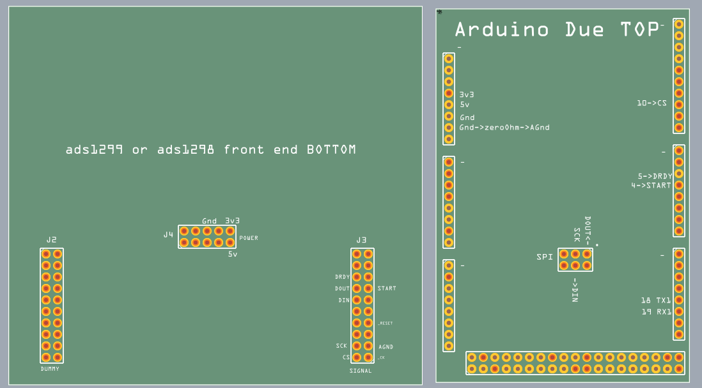
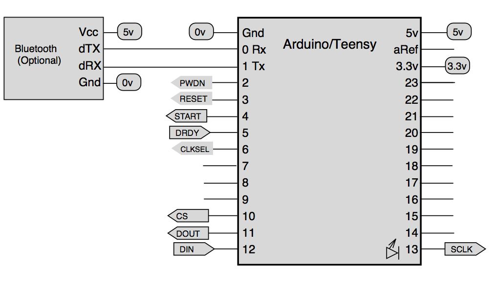
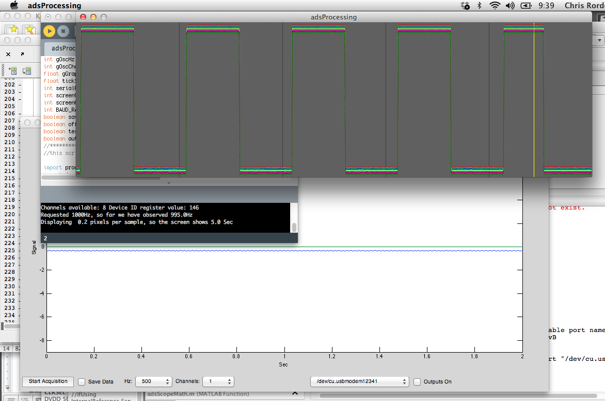

# DIY Electrophysiology

**Note: this is an old page in an active field. Please see the links at
the bottom of the page for projects that extend this work.** Electrodes
on the skin can be used to measure muscle (electromyography, EMG) brain
(electroencephalography, EEG) and heart (electrocardiogram, ECG/EKG)
activity. These electrophysiological measures are popular for clinical,
research and hobbyist applications (such as brain computer interfaces).
Most commercial systems are "medical grade" -- these expensive systems
offer high precision (16-24 bits), participant electrical isolation as
well as support. On the other hand, there are numerous "hobby grade"
solutions that are very inexpensive but do provide fewer features. Here
we describe a "research grade" solution offering the same precision and
safety of the medical systems, with the ability to add time stamps (for
averaging data across trials) at a much lower cost (though without the
FDA approval or support, so use these designs at your own risk).

## Overview

This is an open source project for recording high quality
electrophysiological data using an ADS129n compatible front-end. These
chips support 4 (ADS1294), 6 (ADS1296) and 8 (ADS1298, ADS1299) channels
for measurement with 24-bit precision (and if you need even more
channels, you can daisy-chain multiple chips). The ADS communicates
using a serial peripheral interface (SPI) link. In this design, an
Arduino-compatible microcontroller translates between SPI and a
Bluetooth or USB Serial Port Connection. Software in the Matlab and
Processing languages allows a computer to record these serial port
signals. The connection between the computer and the Arduino should be
electrically isolated -- either via a wireless bluetooth module (the
JY-MCU sells for \$8) or an electrically isolated USB connection (e.g.
using an ADUM4160, \$11).

One nice feature of the ADS129n is that they provide 24-bit precision.
This allows a single hardware design to be used for very different
applications (spanning EEG to ECG and EMG). In contrast, a 16-bit design
needs to be tuned for the small and slow signals of scalp recorded EEG
or the quick and relatively huge signals generated by superficial
muscles in EMG. The chip also contains a number of sophisticated options
for filtering data and acquiring ECG. The newer ADS1299 is
pin-compatible with the ADS1298 providing a bit better precision but
requiring more current.

The host computer can send signals to control the amplifier (e.g.
specify the number of channels to send, the amplifier gain, sample rate,
etc). The software and datasheets describe how to do this. Once the
computer has specified the desired settings, a RDATAC (read data
continuously) causes the amplifier to begin streaming data back until a
SDATAC (stop continuous data) command is sent. In my code, the Arduino
converts serial port signals directly to SPI signals, so the host
software has complete control of the ads129n setup, and the code is
identical for SPI or serial port communication. However, my Arduino code
does alter the format for RDATAC data when transferring data from the
SPI to serial port. The reason for this is that the SPI interface has a
tremendous amount of bandwidth (e.g. the Teensy 3 can in theory support
21 Mbs), whereas Bluetooth connections are much more limited (e.g.
inexpensive Bluetooth modules max out at about .4 Mbs). For every
sample, the ADS129x SPI link will send 3+3\*n bytes of data per channel,
where n is 4 (ADS1294), 6 (ADS1296) and 8 (ADS1298, ADS1299). Therefore,
even when you record a single channel (3 bytes), the ADS1298 sends 27
bytes of data per sample. To conserve bandwidth, this project sends
1+3\*n where n is the number of ACTIVE channels. Therefore, if you set a
channel to be disabled ("input shorted") it will not require bandwidth.
The first sample transmitted via the serial port is the same header byte
reported by the SPI data format -- this includes a signature (to help
detect the first byte in each sample) and 4 bits that report the status
of the 4 GPIO (general purpose inputs/outputs) that allow you to record
time stamps. This sounds complicated, but the example Matlab and
Processing software demonstrate how to implement these communications.

## Implementation

I prefer to use a [Teensy 3.0
(T3)](https://www.pjrc.com/store/teensy3.html) for this application. It
is inexpensive, natively supports 3.3v signals, and can support high
speed (460800 bps in my experience) BlueTooth communications. The T3 has
a hardware SPI port (pins 10-13) and an additional hardware serial port
(pins 0 and 1) which can be used for a bluetooth module. The image shows
the connections. Pins 0 and 1 are connected to the Bluetooth module. Pin
4 is connected to the ADS "START". Pin 5 is connected to the ADS "DRDY"
(data ready). Pin 10 is connected to CS (Chip Select). Pin 10 (DOUT) is
connected to the ADS "DIN" (Data In) while Pin 11 (DIN) is connected to
the ADS "DOUT" (Data out). Pin 13 is connected to the ADS "CLK" (clock).
Optionally, connect pin 2 to PWDN (power down), pin 3 to RESET (reset)
and pin 6 to CLKSEL (clock source). To omit these connections, PWDN,
RESET and CLKSEL should in theory be pulled high (to 3.3v, DVDD), though
with the demonstration boards they float high so can be left
unconnected. Note you can always send the RESET command as an op-code
from software. The T3 will also supply power to ads129n front end board
-- you will want to provide 5v, 3.3v and 0v (ground) in addition to
linking the ads129n analog ground (AGND) to the T3 0v with a 0 Ohm 1/10
Watt resistor (which acts like a fuse to protect the participant). The
Due image below shows the location of these pins on the ads129n front
end boards. This code works with an Arduino Due as well, though in my
experience the BlueTooth modules are limited to around 115200 bps
speeds, so it is less well suited for wireless communication. However,
it is important to note that the upcoming [EEG
Mouse](https://github.com/OpenElectronicsLab/eeg-mouse) design will have
the same microprocessor as the Due, so software should be optimal for
that application. The essential wiring for connecting a Due to the
ads1298 or ads1299 front end kits is shown on the left. Note that this
figure shows the BOTTOM of the front end board (so that the header pins
are accessible) and the top of the Due (so its pins are also
accessible). The J4 jumper gets the 5v, 3.3v and 0v (ground) power. The
J3 jumper has the signal pins -- the required pins are pins are the SPI
clock (SCK), Data Out (DOUT), Data In (DIN), chip select (CS), Data
Ready (DRDY) and Start (START). Again, note that the Arduino and ads129n
cross their DIN/DOUT -- in the figure I use '->DIN' to show that this
Due (DOUT) pin connects to the ads129n DIN pin. You must also connect
the ground to of the Due to the analog ground of the ads129n -- this
should be done with a zero ohm 1/10 watt resistor (that acts as a fuse
for protecting the participant). The diagram also shows the pins for
connecting a blue tooth module (TX1, RX1) -- remember the bluetooth
module also requires power. Please note that for wired communications my
software assumes you will connect your Due to your computer's USB port
with the Due's fast "Native" port rather than the slow "Programmer" port
(the Due has two USB sockets). In theory, you could use other Arduino
compatible devices for connecting to the ads129n devices. However, the
Arduino would need to support SPI and would need to have a high speed
serial port (older designs like the Uno have very slow serial
connections). Two possible candidates are the Teensy 2.0 and Arduino
Leonardo. However, be warned that these devices use 5 volt signals that
may not work with and **could even damage the ads129n** (which can only
handle signals up to \~3.4 volts). Therefore, you would need to add
voltage dividers to each signal line. Therefore, the T3 and Due (that
natively operate at 3.3v) are simpler for this application, and
generally provide better performance.

You can purchase the [ADS1298](https://www.ti.com/tool/ADS1298ECGFE-PDK)
(ideal for ECG) or [ADS1299](https://www.ti.com/tool/ads1299eegfe-pdk)
(ideal for EEG) Performance Demonstration Kits for about \$200. The
ADS1298 kit can connect to a standard EMG connector (about \$40). For
EMG or EEG you will probably be better served with the ADS1299 kit
connected to some DIN 42-802 sockets. In the near future expect to see a
less expensive, smaller open source design that can be used instead of
the demonstration kit (e.g. the [EEG Mouse
team's](https://github.com/OpenElectronicsLab/eeg-mouse) REV1 board will
integrate an Arduino compatible microcontroller on the same board as an
ADS1299, the previous REV0 design can be
[fabricated](https://oshpark.com/) and used instead of the demonstration
kit).

## Testing your wiring

The first program to run on your Arduino/T3 is the "adsArd_hello_world"
- this just makes sure that your Arduino is wired correctly to your
ads129n. Load this software onto your Arduino/T3 using a USB cable (make
sure to connect the cable to the 'Native' rather than 'Programmer' port
if you use a Due) and then select Tools/SerialMonitor. You should see a
message like "Device Type (ID Control Register): 62 Channels: 8"
repeated regularly. If this works, you have wired everything correctly.
If you are told the "Channels: 0" then there is a problem.

## Upgrading a Bluetooth Module

Most commercial Bluetooth modules are initially programmed to only
communicate at 9600bps. The included Arduino sketch
"Bluetooth_Programmer_Ard" allows you to reset your module for higher
speeds -- in my experience inexpensive modules run at 460800bps with the
Teensy 3 (and 115200 bps with the Due). You only have to run this script
once -- check the Arduino Serial Monitor to follow the progress. Once
your module is reprogrammed it will use the new speed whenever it is
restarted. Once you have reprogrammed your module, remember to put a
more useful sketch onto your Arduino (for example, the adsArd sketch
described below).

## Arduino Software

The Arduino sketch "adsArd" programs an Arduino-compatible device to
translate the ADS129n SPI data to the USB and BlueTooth ports. This
script has only been tested on the Teensy 3. We suspect it will work on
the Arduino Due once the developers tune the native serial port for
binary communications. Unless you use a Teensy3, you will need to edit a
few lines in adsCMD to specify the pins used for SPI communication (for
example, the [Teensy 2 uses pins 1,2,3 for SPI
communications](https://www.pjrc.com/teensy/td_libs_SPI.html) ). Once
your Arduino has been re-programmed, it will act as a SPI-serial
interposer whenever it is restarted. For the Teensy 3, the light on the
device will be off when the ADS129n is resting, dimly lit when the
ADS129n is streaming data, and will blink slowly if the Teensy is unable
to detect a ADS129x (check the connections between the Teensy and the
ADS129x).

## Matlab software

The Matlab software lets the user specify the sampling rate, number of
channels, and whether or not you wish to save the data. If requested,
the data will be saved in BrainVision analyzer format, which you can
view with the free ELEcro or EEGlab software.

## Processing software

By editing the first few lines of the Processing script you can specify
the sampling rate, number of channels, and whether or not you wish to
save the data. If requested, the data will be saved as tab-delimited
text. You can view these files with your favorite spreadsheet.

## Links

 - [Chipstein](https://sites.google.com/site/chipstein/) describes probably the best hobby grade EMG (16-bit) and EEG (10-bit) around. The section on electrodes and skin preparation is vital for any electrophysiological recording.
 - The [EEG Mouse](https://github.com/OpenElectronicsLab/eeg-mouse) team are developing a complete open source ADS129n hardware project with an Arduino-compatible processor built onto the board. Our intention is that the software we describe on this page can be used on this hardware to record data.
 - The [ADS1298ECG Front End Performance Demonstration Kit](https://www.ti.com/tool/ADS1298ECGFE-PDK) includes a ADS1298 module that can be directly plugged into a Teensy 3 or other Arduino compatible device. Note that the configuration of the input channels is really optimized for ECG rather than EMG or EEG. The ads129n can do some sophisticated preprocessing of ECG data. EMG and EEG are simpler, but if you wish to use this demonstration kit for those applications you will need to use the jumpers appropriately.
 - [Raul Aguaviva](https://codinglab.blogspot.be/2013/07/my-heartbeat.html) describes a simple ECG system that can input into his [XOscillo](https://code.google.com/archive/p/xoscillo/) software.
 - [Scott Harden](https://www.swharden.com/blog/2013-04-14-simple-diy-ecg-pulse-oximeter-version-2/) describes the an elegantly simple hobby-grade ECG and optical pulse measurement system.
 - [Josh Wojnas](https://sites.google.com/site/openloopproject/Home/code-valt) provides plans for a simple ADS1298 hardware board.
 - StarCat provides the [HackEEG shield](https://starcat.io/products/hackeeg-shield/)
 - [OpenBCI](https://shop.openbci.com) provides impressive products.
 - The work described here has been extended by [Adam Feuer](https://github.com/adamfeuer/ADS129x-tools).
